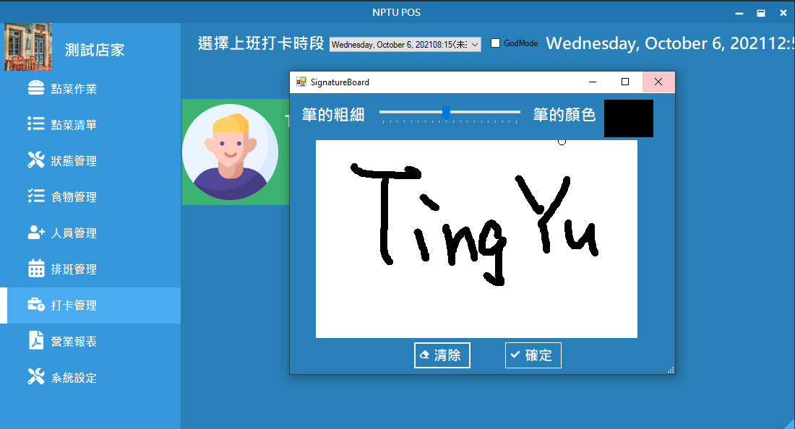

# Restaurant POS System

## Motivation
After ordering food in the student restaurant in NPTU (National Pingtung University), you will typically get an order id from the shop and have to wait until the food is prepared, when the clerk will announce the order id. 

Everything seems to be all right, but when the restaurant is crowded, it would be very difficult for the clerk to announce the order id because everyone is talking out loud, and at the same time you also have to listen very carefully for the order id being announced, causing you to not being able to concentrate on other things, which can be a really bad "user experience". You'll also lose some time just waiting and listening for your order id.

That is the reason why I, along with my classmates, have developed a restaurant POS system, hoping to solve the above-mentioned problem and at the same time improve the overall user experience in the student restaurant in NPTU.

Specifically, our system is able to show current order id on the screen facing toward outside of the shop, allowing customers to check order id currently being announced by looking at it instead of having to keep listening for it. In addition, customers will be able to see what they have ordered on the screen, which can be of great help when you are ordering lots of things and can reduce confusion and miscommunication between you and the clerk. The above-mentioned functionality is possible with the help of Windows multi-monitor technology.
## Main Features
1. The ability to help manage and order food.
2. The ability to help manage and order shifts.
3. Add a screen facing toward ouside of the shop for easier food ordering and order id checking.
4. The ability to record employees's time of arrival and departure.
4. The ability to generate monthly report.

## Out of box experience
When it comes to software development in the past 5 years, it is all about user experience. Since users nowadays have a wide variety of choices, it is necessary that the app you develop have good user experience, or users may end up choosing another competing product. That's why we have chosen to implement a user-friendly out of box experience to help user to quickly get the system up and running.

## Screenshots

